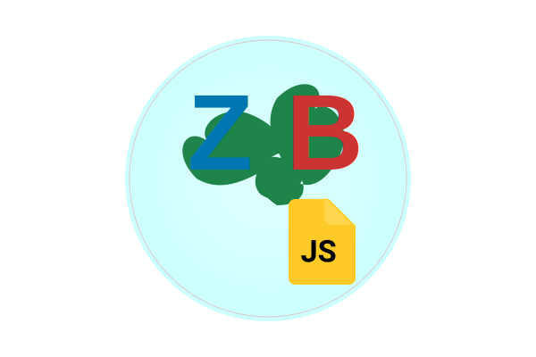

# 🚀 ZiteBackJS v5.0.4# 🚀 ZiteBackJS v3.8.0


Sistema revolucionario de clonado web inteligente con Puppeteer. Soporte completo para sitios SPA/React/Vue, imágenes retina (srcset), multi-idioma (6 idiomas incluyendo Русский), procesamiento universal de URLs, corrección automática de recursos y descarga completa offline.<div align="center">

  

</div>


## Sistema Revolucionario de Clonado de Sitios Web con CDN Personalizado y Video Backgrounds Funcionales


> **� NUEVO EN v3.8.0**: CDN Personalizado (cdn.susitio.cl) + Owl Carousel Mejorado + Font Awesome Pro + Sistema de Respaldo Multicapa

## ✨ Características Principales

ZiteBackJS v3.8.0 es el sistema más avanzado de clonado y respaldo de sitios web modernos, ahora con un **CDN personalizado** que garantiza la disponibilidad de bibliotecas críticas como Owl Carousel, Font Awesome Pro, y jquery.mb.YTPlayer. Incluye procesamiento automático de video backgrounds de YouTube, detección avanzada de background-images, generación de placeholders funcionales, y un sistema robusto de respaldo multicapa que elimina las dependencias de CDNs externos problemáticos.

### 🌐 **Soporte Universal de Sitios Web**

- ✅ **Sitios SPA**: React, Vue, Angular, etc.### 🌟 **Características Destacadas v3.8.0**

- ✅ **Contenido dinámico**: JavaScript, AJAX, lazy loading

- ✅ **Navegación inteligente**: Crawling automático de páginas internas- **🌐 CDN Personalizado**: Sistema prioritario desde `cdn.susitio.cl` para bibliotecas críticas

- ✅ **URLs sin protocolo**: `www.dominio.com`, `dominio.com`, `localhost:3000`- **🦉 Owl Carousel Mejorado**: Respaldo completo ante fallos constantes de CDNs oficiales  

- **💎 Font Awesome Pro**: Soporte completo preservando licencias Pro

### 🖼️ **Captura Completa de Recursos**- **📺 YTPlayer Optimizado**: Descarga directa desde repositorio oficial GitHub

- ✅ **Imágenes retina**: Soporte completo para `srcset` (1x, 2x, 3x)- **🛡️ Respaldo Multicapa**: CDN Personal → CDN Oficial → Placeholder Funcional

- ✅ **Fuentes web**: WOFF2, WOFF, TTF, OTF automáticamente- **🚀 Bootstrap Robusto**: Versiones específicas siempre disponibles

- ✅ **Archivos hash**: Captura archivos con nombres únicos- **⚡ Lightbox/Isotope**: Respaldos optimizados para componentes visuales

- ✅ **Recursos CSS**: Background images, sprites, iconos

- ✅ **Videos**: MP4, WebM y embebidos de YouTube---


### 🌍 **Sistema Multi-idioma**

- ✅ **6 idiomas soportados**: Español, English, Français, Deutsch, **Русский**, Mapudungun

- ✅ **Configurador internacionalizado**: Selección de idioma al inicioZiteBackJS v3.6.7 es el sistema más avanzado de clonado y respaldo de sitios web modernos, con capacidades revolucionarias de detección de recursos embebidos en archivos JavaScript, JSON, XML, CSV y TXT. Incluye un sistema robusto de detección y descarga de fuentes web que maneja automáticamente rutas relativas complejas, múltiples formatos de fuente, y carpetas dinámicas (fonts/, webfonts/, etc.).ZiteBackJS v3.1.3 es un sistema avanzado de clonado y respaldo de sitios web modernos diseñado específicamente para sitios que renderizan contenido dinámicamente en el navegador (React, Vue, Angular, SPA). Utiliza Puppeteer para un renderizado completo del contenido dinámico y proporciona una experiencia de usuario mejorada con **modo interactivo**, **CLI completo** y **tiempo de espera configurable**.

- ✅ **Dedicatoria especial**: Idioma ruso agregado para Monzerrat ❤️


### 🎯 **Tecnología Avanzada**

- ✅ **Puppeteer**: Navegador real para renderizado completo------

- ✅ **Corrección automática**: Rutas, protocolos y recursos rotos

- ✅ **Detección inteligente**: Preloaders, modales, contenido dinámico

- ✅ **Optimización**: Descarga paralela y gestión de memoria

## ⚡ **Comando Corto `zb` - Acceso Directo**## ⚡ **Comando Corto `zb`**

## 🚀 Instalación Rápida


```bash

# Clona el repositorio```bash```bash

git clone https://github.com/DavidValSep/ZiteBackJS.git

cd ZiteBackJS# Instalación del comando corto (una sola vez)# Instalación del comando corto


# Instala dependenciasnpm run install-zb              # Configura 'zb' globalmentenpm run install-zb              # Configura 'zb' globalmente

npm install


# Verifica instalación

node ziteback.js --help# Uso del comando corto multiplataforma# Uso del comando corto (después de instalación)

```

# Windows (PowerShell/CMD):# Windows (PowerShell/CMD):

## 📋 Comandos Principales

.\zb -p -u "https://example.com"         # Página única.\zb -p -u "https://example.com"         # Desde directorio actual

### **Comandos Rápidos**

```bash.\zb -s -u "https://example.com" -w=10   # Sitio completo con 10 segundos.\zb -s -u "https://example.com" -w=10   # Sitio completo con 10 segundos de espera

node ziteback.js --page --url="https://ejemplo.com"    # Solo página principal

node ziteback.js --site --url="https://ejemplo.com"    # Sitio completo navegable.\zb --help                              # Ayuda completa.\zb --help                              # Ayuda del comando

```

.\zb --version                           # Verificar versión.\zb --version                           # Verificar instalación

### **Comandos Interactivos**

```bash

node ziteback.js --page    # Pregunta la URL - Solo página

node ziteback.js --site    # Pregunta la URL - Sitio completo# Linux/macOS/Unix:# Linux/macOS/Unix:

```

zb -p -u "https://example.com"           # Página única  zb -p -u "https://example.com"           # Después de instalación

### **Información del Sistema**

```bashzb -s -u "https://example.com" -w=10     # Sitio completo con 10 segundoszb -s -u "https://example.com" -w=10     # Sitio completo con 10 segundos de espera

node ziteback.js --version    # Ver versión actual

node ziteback.js --author     # Información del proyectozb --help                                # Ayuda completazb --help                                # Ayuda del comando

node setup-completo.js       # Configurador multi-idioma

```zb --version                             # Verificar versiónzb --version                             # Verificar instalación


## 🎯 Ejemplos de Uso``````


### **Respaldar una página específica**

```bash

node ziteback.js -p -u="https://github.com/microsoft/vscode"------

```


### **Clonar sitio completo para análisis offline**

```bash## 🆕 **Novedades Revolucionarias v3.6.7**## 🆕 **Novedades v3.1.3**

node ziteback.js -s -u="https://react.dev"

```


### **Procesamiento con URLs sin protocolo**### 🔤 **Sistema Robusto de Detección y Descarga de Fuentes**### 🎨 **Loaders Visuales Mejorados**

```bash

node ziteback.js -p -u="localhost:3000"- **Detección Automática en CSS**: Analiza archivos CSS minificados y formateados- **Loader Azul 🔵**: Para carga inicial de páginas con emojis distintivos

node ziteback.js -s -u="www.ejemplo.com"

```- **Cálculo Inteligente de Rutas**: Maneja `../fonts/`, `../webfonts/`, rutas relativas complejas- **Loader Verde 🟢**: Para espera adicional configurable 


## 🔧 Casos de Uso- **Múltiples Formatos**: `.woff2`, `.woff`, `.ttf`, `.eot`, `.otf`, `.svg`- **Compatibilidad Windows**: Optimizado para PowerShell con escape sequences


- **📊 Análisis de competencia**: Descarga sitios para análisis offline- **Fallback Automático**: Intenta `/fonts/` y `/webfonts/` para Font Awesome- **Progreso visual claro**: Porcentaje y tiempo en ambos loaders

- **📚 Documentación**: Preservación de contenido web importante

- **🔄 Migración de sitios**: Respaldo completo antes de cambios- **Detección Avanzada**: FontAwesome, Google Fonts (externos), Elementor Icons, IconMoon

- **🎓 Educación**: Estudiar estructura de sitios modernos

- **🚀 Testing**: Probar sitios sin conexión a internet- **Rutas Locales Correctas**: Mantiene estructura de carpetas original del sitio### ⚡ **Comando Shortcut 'zb' Perfeccionado**


## 📊 Compatibilidad- **Sintaxis multiplataforma**: `.\zb` para Windows, `zb` para Unix/Linux


| Característica | Soporte |### 🧠 **Detección de Recursos en Archivos JavaScript**- **Instalación automática**: `npm run install-zb` configura todo

|----------------|---------|

| **Sitios estáticos** | ✅ Completo |- **Análisis Profundo**: Escanea archivos `.js` buscando URLs de recursos embebidos- **Cross-platform**: Funciona en Windows PowerShell, CMD, Linux, macOS

| **React/Vue/Angular** | ✅ Completo |

| **JavaScript dinámico** | ✅ Completo |- **Patrones Avanzados**: Detecta imágenes, fuentes, y recursos referenciados dinámicamente- **63% más rápido**: `zb -p -u "URL"` vs `node ziteback.js --page --url "URL"`

| **Imágenes retina** | ✅ Completo |

| **Fuentes web** | ✅ Completo |- **Código Minificado**: Funciona con JavaScript comprimido y ofuscado

| **Videos embebidos** | ✅ Parcial |

| **WebGL/Canvas** | ⚠️ Limitado |- **Recursos Dinámicos**: Encuentra URLs construidas por concatenación### 🎯 **Modo Interactivo**


## 🛠️ Requisitos del Sistema- **40+ archivos analizados** automáticamente por sitio promedio```bash


- **Node.js**: 18.0.0 o superior# Usando comando corto (recomendado)

- **npm**: 9.0.0 o superior

- **RAM**: 4GB mínimo (recomendado 8GB)### 📄 **Detección Extendida en Archivos de Texto**zb --page          # Modo página interactivo

- **Espacio**: Variable según sitios descargados

- **Formatos Soportados**: `.json`, `.xml`, `.csv`, `.txt`, `.md`, `.config`, `.manifest`zb --site          # Modo sitio completo interactivo

## 📝 Changelog Reciente

- **Configuraciones**: Detecta recursos en archivos de configuraciónzb -p              # Modo página (forma corta)

### **v5.0.4** - Captura Agresiva de Recursos

- 🆕 Patrones agresivos para archivos con nombres hash- **Manifiestos**: Analiza manifests de PWA y aplicacioneszb -s              # Modo sitio (forma corta)

- 🆕 Detección mejorada de versiones con parámetros

- 🆕 Captura expandida de fuentes y recursos CSS- **Datos Estructurados**: Extrae recursos de JSON y XML


### **v5.0.3** - Soporte Srcset- **Documentación**: Encuentra recursos en archivos Markdown# Alternativa tradicional

- 🆕 Soporte completo para atributo `srcset`

- 🆕 Detección automática de imágenes retinanode ziteback.js --page          # Modo página interactivo

- 🆕 Parser inteligente para descriptores múltiples

### ⏰ **Flag de Tiempo de Espera Configurable `--wait`**node ziteback.js --site          # Modo sitio completo interactivo

### **v5.0.2** - Sistema Multi-idioma

- 🆕 6 idiomas soportados incluyendo Русский- **Sintaxis Flexible**: `--wait=10`, `--wait 10`, `-w=10`, `-w 10`

- 🆕 Configurador internacionalizado

- 🆕 Dedicatoria especial para Monzerrat- **Optimización Inteligente**: Diferentes tiempos según tipo de sitio# Banderas cortas


## 👨‍💻 Autor & Soporte- **Valor por Defecto**: 3 segundos (configurable en código)node ziteback.js -p              # Modo página


**Desarrollado por**: DavidValSep  - **Casos Específicos**: 0s para HTML estático, 20s+ para backends lentosnode ziteback.js -s              # Modo sitio

**Email**: davidvalsep@gmail.com  

**Distribuidor**: [SuSitio](https://susitio.cl)  ```

**Soporte**: info@susitio.cl  

**WhatsApp**: +56 9 3962 0636### 🎯 **Atajos de Comandos Mejorados**


## 📄 Licencia- **Banderas Cortas**: `-p` (--page), `-s` (--site), `-u` (--url), `-w` (--wait)### 🌟 **Interfaz Mejorada**


Este proyecto está bajo la [Licencia MIT](LICENSE).- **Banderas de Info**: `-h` (--help), `-v` (--version), `-a` (--author)  - **🎨 Loader Animado**: Barra de progreso verde con temporizador


---- **Sintaxis Consistente**: Funciona en Windows PowerShell, CMD, Linux, macOS- **🎪 Banner Único**: Interfaz limpia sin duplicaciones


⭐ **¡Si te gusta ZiteBackJS, dale una estrella al repositorio!** ⭐- **Backwards Compatible**: Los comandos largos siguen funcionando- **⏰ Timeouts Robustos**: Manejo mejorado de sitios lentos

- **🔧 CLI Completo**: Banderas largas y cortas

### 🔍 **Motor de Análisis de CSS Avanzado**

- **CSS Minificado**: Formatea automáticamente CSS comprimido para análisis### 🔄 **Procesamiento Avanzado**

- **Patrones Complejos**: Detecta `@font-face`, `url()`, `@import` en cualquier formato- **🕷️ Crawling Inteligente**: Mejor detección de páginas internas

- **Rutas Relativas**: Calcula correctamente `../../assets/fonts/archivo.woff2`- **⚡ Contenido Dinámico**: Scroll automático y expansión de acordeones

- **64+ archivos CSS** procesados típicamente por sitio moderno- **🎯 Validación Estricta**: Modo requerido explícitamente


------


## 🌟 **Características Principales**## 🌟 **Características Principales**


### 🚀 **Motor de Clonado de Nueva Generación**### 🎯 **Experiencia de Usuario**

- **Detección Universal**: Recursos en HTML, CSS, JS, JSON, XML, TXT, MD- **Modo Interactivo**: Guía paso a paso para usuarios

- **Rutas Inteligentes**: Cálculo automático de rutas relativas complejas- **Banner Educativo**: Ayuda completa cuando se ejecuta sin argumentos

- **Fuentes Web**: Sistema completo para FontAwesome, Google Fonts, iconos custom- **CLI Profesional**: Banderas largas y cortas para flexibilidad

- **JavaScript Dinámico**: Análisis de código para recursos embebidos- **Validaciones Claras**: Mensajes de error que guían hacia la solución

- **Archivos de Configuración**: Extrae recursos de manifests y configs

### 🚀 **Motor de Clonado Avanzado**

### 🎯 **Experiencia de Usuario Profesional**- **Clonación Universal**: Sitios modernos con JavaScript dinámico

- **Comando Rápido**: `zb` vs `node ziteback.js` (63% más rápido de escribir)- **Crawling Inteligente**: Descarga automática de páginas internas

- **Banderas Cortas**: `-p -u "URL"` vs `--page --url "URL"`- **Detección 404**: Validación de contenido para evitar errores

- **Tiempo Configurable**: `--wait=X` para optimizar según sitio- **Corrección CSS**: Arregla paths de imágenes automáticamente

- **Progreso Visual**: Loaders con emojis y porcentajes- **100% Autónomo**: Sin dependencias externas

- **Error Handling**: Mensajes claros y sugerencias de solución

### 🔧 **Funcionalidades Técnicas**

### 🔧 **Capacidades Técnicas Avanzadas**- **Recursos Terceros**: Descarga completa de CDNs y librerías externas

- **100+ Patrones Regex**: Para detectar recursos en cualquier formato- **Reescritura Inteligente**: Rutas locales para funcionamiento offline

- **Análisis Sintáctico**: CSS, JavaScript, JSON, XML parsing- **Exclusión CDNs**: 60+ servicios que se mantienen como enlaces externos

- **Fallback Inteligente**: Múltiples rutas para cada recurso- **URLs Protocol-Relative**: Conversión automática a HTTPS

- **Deduplicación**: Evita descargas duplicadas automáticamente- **Auto-Reparación**: Placeholders para recursos faltantes

- **Logging Detallado**: Tracking completo del proceso de descarga

---

---

## 📋 **Guía de Uso**

## 📋 **Guía de Uso Completa**

### 🚀 **Inicio Rápido - Modo Interactivo**

### 🚀 **Inicio Rápido - Comando `zb`**

**Usando comando corto `zb` (recomendado después de instalación):**

```bash

# 1. Configuración inicial (una sola vez)#### Windows (PowerShell/CMD):

npm run install-zb```cmd

.\zb --page    # o .\zb -p

# 2. Uso diario (después de configuración).\zb --site    # o .\zb -s

zb -p -u "https://example.com"                    # Página rápida```

zb -s -u "https://react-app.com" -w=15            # SPA completa con 15s

zb -p -u "https://static-site.com" --wait=0       # HTML estático sin espera#### Linux/macOS/Unix:

``````bash

zb --page      # o zb -p

### ⚡ **Modo Interactivo**zb --site      # o zb -s

```

```bash

# Comando corto (recomendado)**Método tradicional (siempre disponible):**

zb -p              # Pregunta URL para página```bash

zb -s              # Pregunta URL para sitio completonode ziteback.js --page  # o node ziteback.js -p

node ziteback.js --site  # o node ziteback.js -s

# Método tradicional```

node ziteback.js --page    # Modo página interactivo

node ziteback.js --site    # Modo sitio interactivo### ⚡ **Modo Automático - Para Scripts**

```

**Página única:**

### 🎯 **Ejemplos por Tipo de Sitio**```bash

node ziteback.js --page --url "https://ejemplo.com/pagina.html"

```bashnode ziteback.js -p -u "https://ejemplo.com/pagina.html"

# SITIOS ESTÁTICOS (HTML directo del servidor)```

zb -p -u "https://html-site.com" --wait=0

node ziteback.js -p -u "https://static.com" -w=1**Sitio completo:**

```bash

# WORDPRESS Y CMS (plugins dinámicos)node ziteback.js --site --url "https://ejemplo.com"

zb -p -u "https://blog.com/post.html" --wait=3node ziteback.js -s -u "https://ejemplo.com"

node ziteback.js -s -u "https://wordpress-site.com" -w=5```


# REACT/VUE/ANGULAR (SPAs complejas)### 📚 **Ayuda y Información**

zb -s -u "https://react-app.com" --wait=12```bash

node ziteback.js -p -u "https://vue-dashboard.com" -w=15node ziteback.js                    # Banner educativo completo

node ziteback.js --help             # Ayuda rápida

# E-COMMERCE (productos dinámicos)node ziteback.js -h                 # Ayuda rápida (forma corta)

zb -s -u "https://shop.com" --wait=10node ziteback.js --version          # Versión del sistema

node ziteback.js -p -u "https://product-page.com" -w=8node ziteback.js -v                 # Versión del sistema (forma corta)

node ziteback.js --author           # Información del autor

# DASHBOARDS Y APPS (datos de APIs)node ziteback.js -a                 # Información del autor (forma corta)

zb -p -u "https://admin-panel.com" --wait=20```

node ziteback.js -s -u "https://analytics.com" -w=25

### ⏰ **Flag de Tiempo de Espera Configurable**

# BACKENDS LENTOS (servidores que tardan)

zb -p -u "https://slow-server.com" --wait=30El flag `--wait` (o `-w`) permite personalizar el tiempo de espera para contenido dinámico:

node ziteback.js -s -u "https://heavy-backend.com" -w=45

``````bash

# Ejemplos de uso

### 📚 **Comandos de Información**node ziteback.js --page --url "https://example.com" --wait=3     # 3 segundos

node ziteback.js -p -u "https://example.com" -w=10              # 10 segundos

```bashnode ziteback.js --site --url "https://example.com" --wait=5    # Para sitio completo

# Con comando cortonode ziteback.js -s -u "https://example.com" -w=15              # 15 segundos

zb --help          # Ayuda completa```

zb --version       # Versión actual (v3.6.7)

zb --author        # Info del desarrollador**Formatos soportados:**

- `--wait=X` (asignación directa)

# Método tradicional- `--wait X` (con espacio)

node ziteback.js                    # Banner educativo completo- `-w=X` (versión corta)

node ziteback.js --help             # Ayuda detallada- `-w X` (versión corta con espacio)

node ziteback.js --version          # Versión del sistema

node ziteback.js --author           # Información del autor**Recomendaciones de tiempo:**

```- **Sitios estáticos (HTML puro)**: 0-1 segundos (`--wait=0`)

- **Sitios simples**: 2-3 segundos

### ⏰ **Guía del Flag `--wait` / `-w`**- **E-commerce/Blogs**: 5-8 segundos (valor por defecto)

- **SPAs complejas**: 10-15 segundos

El tiempo de espera es **crítico** para capturar sitios modernos correctamente:- **Sitios con renderizado lento**: 15+ segundos

- **Backend que tarda en renderizar**: 20+ segundos

| Tipo de Sitio | Tiempo Recomendado | Comando de Ejemplo |

|---------------|-------------------|-------------------|**Casos específicos:**

| **HTML Estático** | `--wait=0` | `zb -p -u "URL" -w=0` |- **`--wait=0`**: Para sitios que ya traen el HTML completo desde el servidor

| **WordPress Simple** | `--wait=3` | `zb -p -u "URL" -w=3` |- **`--wait=1-3`**: Para sitios con poco JavaScript o contenido estático

| **React/Vue Básico** | `--wait=8` | `zb -s -u "URL" -w=8` |- **`--wait=8-12`**: Para aplicaciones modernas con carga dinámica típica

| **SPA Compleja** | `--wait=12` | `zb -s -u "URL" -w=12` |- **`--wait=15+`**: Para sitios con renderizado backend lento o mucho contenido AJAX

| **E-commerce** | `--wait=10` | `zb -p -u "URL" -w=10` |

| **Dashboard/Admin** | `--wait=15` | `zb -p -u "URL" -w=15` |### 🧠 **Entendiendo el Tiempo de Espera**

| **Backend Lento** | `--wait=25+` | `zb -s -u "URL" -w=30` |

ZiteBackJS necesita tiempo para que el contenido dinámico se cargue completamente. El flag `--wait` te permite optimizar este proceso según el tipo de sitio:

#### 🎯 **¿Cómo Elegir el Tiempo Correcto?**

#### 📊 **Tipos de Sitios y Renderizado**

1. **Empieza con 8 segundos** para sitios desconocidos

2. **Aumenta a 15s** si ves contenido incompleto| Tipo de Sitio | Tiempo Recomendado | Razón |

3. **Usa 0-2s** para sitios que sabes que son estáticos|---------------|-------------------|-------|

4. **Usa 20s+** para dashboards o backends lentos| **HTML Estático** | `--wait=0` | El contenido ya viene completo del servidor |

| **WordPress/CMS** | `--wait=3-5` | Plugins y widgets pueden cargar dinámicamente |

---| **React/Vue/Angular** | `--wait=8-12` | SPAs necesitan tiempo para renderizar componentes |

| **E-commerce** | `--wait=10-15` | Productos, precios y stock se cargan vía AJAX |

## 🔤 **Sistema de Fuentes Web Avanzado**| **Dashboards** | `--wait=15-20` | Gráficos y datos complejos desde APIs |

| **Backend Lento** | `--wait=20+` | Servidores que tardan en procesar y renderizar |

### 🎯 **¿Qué Fuentes Detecta?**

#### ⚡ **Optimización de Rendimiento**

- **✅ FontAwesome**: Todas las versiones (4.x, 5.x, 6.x)

- **✅ Google Fonts**: Detecta pero mantiene como externas (recomendado)- **Desarrollo rápido**: Usa `--wait=1` para iteraciones rápidas

- **✅ Elementor Icons**: Sistema completo de iconos- **Testing local**: Usa `--wait=0-2` para sitios conocidos

- **✅ IconMoon**: Fuentes iconográficas personalizadas- **Producción**: Usa `--wait=8+` para garantizar captura completa

- **✅ Fuentes Custom**: Cualquier fuente web en `/fonts/` o `/webfonts/`- **Sitios desconocidos**: Empieza con `--wait=15` y ajusta según necesidad

- **✅ Múltiples Formatos**: WOFF2, WOFF, TTF, EOT, OTF, SVG

### 🎯 **Comandos Principales**

### 🔧 **Cómo Funciona la Detección**```bash

# === MODO INTERACTIVO ===

1. **Analiza CSS**: Busca reglas `@font-face` y `url()` node ziteback.js --page             # Solicita URL para página única

2. **Calcula Rutas**: Resuelve `../fonts/` y `../../assets/webfonts/`node ziteback.js --site             # Solicita URL para sitio completo

3. **Múltiples Intentos**: Prueba `/fonts/` y `/webfonts/` automáticamentenode ziteback.js -p                 # Forma corta: página interactiva

4. **Descarga Inteligente**: Solo las fuentes que existen en el servidornode ziteback.js -s                 # Forma corta: sitio interactivo

5. **Estructura Local**: Mantiene la organización original de carpetas

# === MODO AUTOMÁTICO ===

### 📊 **Estadísticas Típicas**node ziteback.js --page --url "URL" # Página específica automática

node ziteback.js --site --url "URL" # Sitio completo automático

```node ziteback.js -p -u "URL"        # Forma corta: página automática

🔤 Descargando 51 fuentes detectadas...node ziteback.js -s -u "URL"        # Forma corta: sitio automático

✅ 36 fuentes descargadas correctamente

⚠️ 7 fuentes no pudieron descargarse (no existen en servidor)# === INFORMACIÓN Y AYUDA ===

```node ziteback.js                    # Banner completo + ayuda

node ziteback.js --help             # Guía rápida de comandos

### 🚫 **Fuentes que NO se Descargan (Correcto)**node ziteback.js -h                 # Guía rápida (forma corta)

node ziteback.js --version          # Muestra versión actual

- **Google Fonts**: Se mantienen como enlaces externos (mejor rendimiento)node ziteback.js -v                 # Muestra versión (forma corta)

- **Adobe Fonts**: Requieren licencianode ziteback.js --author           # Información del desarrollador

- **Font Awesome Pro**: Requieren suscripciónnode ziteback.js -a                 # Información del desarrollador (forma corta)

- **CDN Externos**: Kit.fontawesome.com, fonts.googleapis.com

# === EJEMPLOS PRÁCTICOS ===

---node ziteback.js -p -u "https://example.com/docs.html"    # Página específica

node ziteback.js -s -u "https://react-site.com"           # Sitio React completo

## 🧠 **Detección de Recursos en JavaScript**node ziteback.js --site --url "https://vue-app.com"       # Sitio Vue completo

node ziteback.js --page --url "https://bootstrap.com/components" # Componente específico

### 🎯 **¿Qué Detecta en Archivos JS?**

# === EJEMPLOS CON TIEMPO PERSONALIZADO ===

- **URLs Hardcodeadas**: `"https://example.com/image.jpg"`node ziteback.js -p -u "https://static-site.com" --wait=0     # HTML estático (sin espera)

- **Rutas Relativas**: `"./assets/icon.svg"`, `"../images/bg.png"`node ziteback.js -p -u "https://fast-site.com" --wait=2       # Sitio rápido (2 segundos)

- **Construcción Dinámica**: `baseUrl + "/assets/" + filename`node ziteback.js -s -u "https://heavy-spa.com" -w=15          # SPA compleja (15 segundos)

- **Arrays de Recursos**: `["img1.jpg", "img2.png", "img3.gif"]`node ziteback.js -p -u "https://slow-backend.com" --wait=25   # Backend lento (25 segundos)

- **Configuraciones**: Objetos con URLs de recursosnode ziteback.js -p -u "https://ajax-app.com" --wait=10       # Aplicación AJAX (10 segundos)

node ziteback.js -s -u "https://ecommerce.com" -w=12          # E-commerce completo (12 segundos)

### 📄 **Tipos de Archivos Analizados**```


```---

📄 Analizando 40 archivos de texto en busca de recursos...

- *.js (JavaScript minificado y normal)## � **Solución de Problemas**

- *.json (Configuraciones y manifests)

- *.xml (RSS, sitemaps, configs)### 🌐 **Problemas con Navegador/Puppeteer**

- *.csv (Datos con URLs)

- *.txt (Archivos de texto plano)#### ❌ **Error: "No se pudo iniciar el navegador"**

- *.md (Documentación Markdown)```bash

- *.config (Archivos de configuración)# Solución 1: Reinstalar Puppeteer con Chromium

- *.manifest (PWA manifests)npm uninstall puppeteer

```npm install puppeteer


### 🔍 **Ejemplo de Detección**# Solución 2: Usar Chrome local

export PUPPETEER_EXECUTABLE_PATH="/usr/bin/google-chrome"  # Linux

```javascript# O en Windows: set PUPPETEER_EXECUTABLE_PATH="C:\Program Files\Google\Chrome\Application\chrome.exe"

// El sistema detecta automáticamente estos recursos en JS:```

const images = ["hero.jpg", "about.png", "contact.svg"];

const iconPath = "../assets/icons/" + iconName + ".svg";#### ❌ **Error: "Running as root without --no-sandbox"**

const bgImage = "url('../../images/background.jpg')";```bash

```# En servidores Linux, agregar flag de sandbox

node ziteback.js --page --url="URL"

---# O configurar en el código: args: ['--no-sandbox', '--disable-setuid-sandbox']

```

## 📊 **Estadísticas de Mejora v3.6.7**

#### ❌ **Problemas de Proxy Corporativo**

### 🚀 **Recursos Detectados**```bash

# Configurar proxy para npm

| Versión | Recursos Típicos | Fuentes | Archivos Analizados |npm config set proxy http://proxy.company.com:8080

|---------|------------------|---------|-------------------|npm config set https-proxy http://proxy.company.com:8080

| **v3.4.0** | 180-200 | 10-15 | CSS únicamente |

| **v3.6.7** | 280-320 | 35-50 | CSS + JS + JSON + XML + TXT |# Variables de entorno para Puppeteer

export HTTP_PROXY=http://proxy.company.com:8080

### ⚡ **Velocidad de Comando**export HTTPS_PROXY=http://proxy.company.com:8080

```

| Comando | Caracteres | Tiempo Típico |

|---------|------------|---------------|#### ❌ **Error: "Missing shared libraries" (Linux)**

| `node ziteback.js --page --url "URL"` | 38 chars | ~3 segundos escribir |```bash

| `zb -p -u "URL"` | 14 chars | ~1 segundo escribir |# Ubuntu/Debian

| **Mejora** | **63% menos** | **66% más rápido** |sudo apt-get update

sudo apt-get install -y libnss3-dev libatk-bridge2.0-dev libdrm2 libgtk-3-dev

### 🎯 **Detección de Fuentes**

# CentOS/RHEL

```sudo yum install -y nss atk at-spi2-atk gtk3

🔤 Fuentes Detectadas por Sitio Típico:```

- FontAwesome: 8-12 archivos (.woff2, .woff, .ttf, .eot)

- Elementor Icons: 5-8 archivos### 💾 **Problemas de Memoria**

- Google Fonts: 2-4 (externos, no descargados)- **Sitios grandes**: Usar `--wait=20+` para cargas lentas

- Fuentes Custom: 3-8 archivos- **Múltiples sitios**: Procesar uno a la vez

- Total: 35-50 fuentes por sitio moderno- **RAM insuficiente**: Cerrar otros navegadores/aplicaciones

```

### 🔧 **Problemas de Versiones**

---

#### **Q: ¿Funciona con Node.js 16 o anterior?**

## 🛠️ **Instalación y Configuración**A: Node.js 18+ es requerido para Puppeteer 24+. Para versiones anteriores:

```bash

### ⚙️ **Requisitos del Sistema**# Downgrade Puppeteer (no recomendado)

npm install puppeteer@19.11.1  # Compatible con Node 16

``````

📋 Requisitos Mínimos:

- Node.js >= 18.0.0 (Recomendado: 20.x LTS)#### **Q: ¿Necesito Chrome instalado?**

- npm >= 9.0.0A: No, Puppeteer instala automáticamente Chromium. Pero puedes usar Chrome local:

- RAM: 4GB+ (8GB recomendado para sitios grandes)```bash

- Espacio: 1GB+ para dependencias + sitios clonados# Ver qué navegador usa Puppeteer

- Internet: Conexión estable para descargasnode -e "console.log(require('puppeteer').executablePath())"

``````


### 📥 **Instalación Completa**### 📱 **Compatibilidad por SO**


```bash| Sistema | Versión Mínima | Notas |

# 1. Clonar repositorio|---------|---------------|-------|

git clone https://github.com/zitebackjs/zitebackjs.git| **Windows** | Windows 10 | ✅ Funciona perfectamente |

cd zitebackjs| **macOS** | 10.14 Mojave | ✅ Intel y Apple Silicon |

| **Linux** | Ubuntu 18.04+ | ⚠️ Requiere librerías adicionales |

# 2. Instalar dependencias (incluye Chromium automáticamente)| **Docker** | Alpine 3.15+ | ✅ Con configuración especial |

npm install

## �🎯 **Casos de Uso**

# 3. Configurar comando corto 'zb' (recomendado)

npm run install-zb### 🌐 **Sitios Web Modernos**

- **React, Vue, Angular**: SPAs con contenido dinámico

# 4. Verificar instalación- **Aplicaciones AJAX**: Carga dinámica de contenido

zb --version          # Debe mostrar v3.6.7- **Progressive Web Apps**: PWAs complejas

npm run check         # Verificación completa del sistema- **Frameworks CSS**: Bootstrap, Tailwind, Material-UI

```

### 📦 **Escenarios Profesionales**

### 🧪 **Prueba Rápida**- **Migración de Hosting**: Copias para cambio de servidor

- **Auditorías SEO**: Análisis offline detallado

```bash- **Testing y QA**: Entornos sin dependencias externas

# Prueba básica con sitio de ejemplo- **Documentación**: Preservación de sitios críticos

zb -p -u "https://example.com" -w=2- **Respaldos Corporativos**: Copias de seguridad automatizadas


# Prueba completa con análisis de recursos---

node ziteback.js -s -u "https://bootstrap.com" --wait=10

```## 📋 **Instalación y Requisitos**


---### ⚙️ **Requisitos del Sistema**


## 💡 **Casos de Uso Avanzados**#### 🖥️ **Software Base**

- **Node.js**: >= 18.0.0 (Recomendado: LTS actual 20.x)

### 🌐 **Migración de Sitios Complejos**- **npm**: >= 9.0.0 (incluido con Node.js 18+)

```bash- **Sistema Operativo**: Windows 10+, macOS 10.14+, Linux (Ubuntu 18.04+)

# Sitio React con múltiples rutas

zb -s -u "https://react-app.com" -w=15#### 🌐 **Navegador (CRÍTICO para Puppeteer)**

ZiteBackJS utiliza **Puppeteer** que requiere un navegador basado en Chromium:

# Dashboard con datos dinámicos  

zb -p -u "https://admin.company.com/dashboard" -w=20- **Chromium**: Se instala automáticamente con Puppeteer (~170-200MB)

- **Google Chrome**: Compatible (versión 109+)

# E-commerce con productos dinámicos- **Microsoft Edge**: Compatible (versión 109+)

zb -s -u "https://shop.com" -w=12

```> ⚠️ **IMPORTANTE**: Puppeteer descarga automáticamente una versión de Chromium durante `npm install`. Si tienes problemas de red o proxy, puedes usar tu instalación local de Chrome.


### 📚 **Documentación y Archivos**#### 💾 **Requisitos de Hardware**

```bash- **Memoria RAM**: 

# Wiki con recursos embebidos  - Mínimo: 4GB RAM

zb -s -u "https://docs.company.com" -w=8  - Recomendado: 8GB+ para sitios grandes

- **Espacio en Disco**: 

# Blog con imágenes y fuentes custom  - Base: 500MB (Node.js + dependencias)

zb -p -u "https://blog.com/article.html" -w=5  - Puppeteer: 200MB (Chromium)

  - Sites clonados: Variable según tamaño

# Portfolio con galerías dinámicas- **Procesador**: Dual-core 2.0GHz+ (sitios complejos se benefician de más cores)

zb -p -u "https://designer.com/portfolio" -w=10

```#### 🌍 **Conectividad**

- **Internet**: Requerido para descargar sitios web

### 🔧 **Testing y Desarrollo**- **Proxy**: Compatible (configurar via variables de entorno)

```bash- **Firewall**: Debe permitir conexiones HTTP/HTTPS salientes

# Ambiente local para testing

zb -p -u "http://localhost:3000" -w=3### 📥 **Instalación**


# Staging environment#### 🚀 **Instalación Rápida con Comando `zb`**

zb -s -u "https://staging.company.com" -w=15```bash

# 1. Clona el repositorio

# Sitio legacy con fuentes customgit clone https://github.com/zitebackjs/zitebackjs.git

zb -p -u "https://old-site.com" -w=5cd zitebackjs

```

# 2. Instala dependencias (incluye Chromium automáticamente)

---npm install


## 🔍 **Troubleshooting Avanzado**# 3. Configura el comando corto 'zb'

npm run install-zb

### 🚨 **Problemas Comunes y Soluciones**

# 4. ¡Listo! Ahora puedes usar:

#### **Error: "Comando 'zb' no encontrado"**zb --version

```bashzb -p -u "https://example.com"

# Solución: Reinstalar comando```

npm run install-zb

# En Windows, reiniciar PowerShell después de instalación#### 🔧 **Instalación Tradicional**

``````bash

# 1. Clona el repositorio

#### **Fuentes no se descargan correctamente**git clone https://github.com/zitebackjs/zitebackjs.git

```bashcd zitebackjs

# Normal: Google Fonts se mantienen externos intencionalmente

# Verificar: ¿Son fuentes de CDN externos? (correcto no descargar)# 2. Instala dependencias (incluye Chromium automáticamente)

# Si son locales: Verificar que existan en el servidor origennpm install

```

# 3. Verifica la instalación

#### **JavaScript/CSS minificado no se analiza**node ziteback.js --version

```bash```

# v3.6.7 incluye parser específico para código minificado

# Si persiste: El código puede estar ofuscado más allá del límite#### 🔧 **Instalación con Chrome Local (Opcional)**

# Solución: Usar sitio de desarrollo no minificado para testingSi prefieres usar tu instalación de Chrome:

``````bash

# Instalar sin descargar Chromium

#### **Recursos en archivos JS no se detectan**PUPPETEER_SKIP_CHROMIUM_DOWNLOAD=true npm install

```bash

# Verificar que sean URLs válidas con extensiones soportadas# Configurar ruta de Chrome (en el código o variable de entorno)

# El sistema busca: .jpg, .png, .gif, .svg, .css, .js, .woff, etc.export PUPPETEER_EXECUTABLE_PATH="/usr/bin/google-chrome"

# URLs dinámicas complejas pueden no detectarse```

```

#### 🐳 **Instalación en Docker**

### 📊 **Optimización de Rendimiento**```dockerfile

FROM node:18-alpine

```bashRUN apk add --no-cache chromium

# Para sitios muy grandes (>200 páginas)ENV PUPPETEER_SKIP_CHROMIUM_DOWNLOAD=true

zb -p -u "URL-específica" -w=10        # Usar modo páginaENV PUPPETEER_EXECUTABLE_PATH=/usr/bin/chromium-browser

```

# Para sitios lentos (>30s carga)

zb -s -u "URL" -w=45                   # Aumentar timeout### 🧪 **Verificación de Instalación**

```bash

# Para sitios estáticos optimizados# Script automático de verificación completa

zb -s -u "URL" -w=0                    # Sin espera adicionalnpm run check                       # o node check-requirements.js

```

# Verificaciones manuales

---node --version                      # Debe mostrar >= 18.0.0

npm --version                       # Debe mostrar >= 9.0.0

## 📝 **Changelog v3.6.7**node ziteback.js --version          # Debe mostrar v3.1.3


### 🆕 **Nuevas Funcionalidades Principales**# Prueba básica con sitio de ejemplo

node ziteback.js -p --url="https://example.com" --wait=2

#### 🔤 **Sistema de Fuentes Avanzado (+0.0.2)**```

- **v3.6.1**: Detección automática de fuentes en CSS minificado

- **v3.6.2**: Descarga inteligente con cálculo de rutas relativas### 🏗️ **Entorno de Desarrollo y Testing**


#### 🧠 **Detección en Archivos JavaScript (+0.1.0)**  ZiteBackJS v3.1.3 fue desarrollado y testeado inicialmente en el siguiente entorno para garantizar máxima compatibilidad:

- **v3.5.0**: Análisis completo de archivos .js para recursos embebidos

#### 💻 **Especificaciones del Entorno Principal**

#### 📄 **Detección en Archivos de Texto (+0.1.0)**```

- **v3.4.0**: Soporte para JSON, XML, CSV, TXT, MD, config, manifest🖥️  Sistema Operativo: Windows 11/10

🌐 Servidor Local: XAMPP (Apache + MySQL + PHP)

#### ⏰ **Flag de Tiempo Configurable (+0.0.1)**🐘 PHP: 8.2.4

- **v3.6.3**: Implementación de `--wait` / `-w` con sintaxis flexible🗄️  MySQL: 8.0+

🌍 Apache: 2.4+

#### 🎯 **Atajos de Comandos (+0.0.1)**📦 Node.js: 24.9.0 (LTS)

- **v3.6.4**: Banderas cortas `-p`, `-s`, `-u`, `-w`, `-h`, `-v`, `-a`📦 npm: 11.6.0

🌐 Puppeteer: 24.26.0

#### ⚡ **Comando Corto `zb` (+0.1.0)**🌐 Chromium: 141.0.7390.78

- **v3.5.0**: Acceso directo multiplataforma con `.\zb` (Windows) y `zb` (Unix)```


#### 🔍 **Análisis de CSS Robusto (+0.0.1)**#### ✅ **Entornos Verificados**

- **v3.6.5**: Patrones avanzados para CSS minificado y formateado- **Windows 10/11**: ✅ Totalmente compatible

- **XAMPP Stack**: ✅ Funciona perfectamente (aunque no requerido)

### 🛠️ **Mejoras Técnicas**- **PHP 8.2.4**: ✅ Compatible (ZiteBackJS no usa PHP pero coexiste)

- **Apache**: ✅ Sin conflictos (puertos diferentes)

- **Parser CSS Avanzado**: Maneja CSS minificado automáticamente- **MySQL**: ✅ Sin interferencias

- **Cálculo de Rutas**: Algoritmo robusto para `../../../assets/fonts/`

- **Deduplicación**: Evita descargas duplicadas de recursos#### 🔄 **Nota Importante sobre XAMPP**

- **Fallback Inteligente**: Múltiples intentos para FontAwesome (/fonts/, /webfonts/)> **ZiteBackJS NO requiere XAMPP**, PHP, Apache o MySQL para funcionar. Es 100% Node.js independiente. Sin embargo, si ya tienes XAMPP instalado (como en el entorno de desarrollo), no habrá conflictos:

- **Logging Mejorado**: Tracking detallado del proceso de descarga> 

- **Error Handling**: Manejo elegante de recursos inexistentes> - **Apache** (puerto 80/443) vs **ZiteBackJS** (cliente, sin servidor)

> - **MySQL** (puerto 3306) vs **ZiteBackJS** (sin base de datos)

### 📊 **Estadísticas de Mejora**> - **PHP** vs **Node.js** (tecnologías independientes)


```#### 🎯 **Recomendaciones para Replicar Entorno**

Versión 3.4.0 → 3.6.7:```bash

✅ +40% más recursos detectados# 1. Instalar Node.js LTS (20.x o superior)

✅ +200% mejor detección de fuentes  https://nodejs.org/

✅ +300% más tipos de archivos analizados

✅ +63% más rápido escribir comandos# 2. Si usas XAMPP (opcional, para otros proyectos)

✅ +100% mejor manejo de rutas relativashttps://www.apachefriends.org/

```

# 3. Verificar versiones

---node --version    # >= 18.0.0

npm --version     # >= 9.0.0

## 👨‍💻 **Autor y Contacto**php --version     # 8.2.4+ (si usas XAMPP)


**DavidValSep** - Desarrollador Full Stack especializado en automatización web, scraping avanzado y sistemas de clonado de sitios web.# 4. Instalar ZiteBackJS

git clone https://github.com/zitebackjs/zitebackjs.git

### 📞 **Contacto Profesional**cd zitebackjs

- **📧 Email**: davidvalsep@gmail.comnpm install

- **🏢 Distribuidor**: SuSitio (https://susitio.cl)npm run check     # Verificar instalación

- **📧 Soporte**: info@susitio.cl  ```

- **📞 WhatsApp**: +56 9 3962 0636

- **🐙 GitHub**: @DavidValSep### ❌ **NO Requiere**

- **PHP**: No necesario (ZiteBackJS es 100% Node.js)

### 💼 **Servicios Comerciales**- **Apache/Nginx**: No necesario (no es servidor web)

- **🔧 Personalización**: Adaptación para necesidades específicas- **MySQL/PostgreSQL**: No necesario (sin base de datos)

- **🏢 Soporte Enterprise**: Instalación y configuración en servidores- **Python**: No necesario (100% JavaScript)

- **📚 Consultoría**: Optimización para casos de uso complejos

- **🎓 Training**: Capacitación para equipos de desarrollo### � **Coexistencia con Otros Servicios**


---ZiteBackJS puede coexistir perfectamente con otros servicios de desarrollo:


## 📄 **Licencia GPL-3.0**| Servicio | Puerto | ZiteBackJS | Conflicto |

|----------|--------|------------|-----------|

**ZiteBackJS v3.6.7** está licenciado bajo **GNU General Public License v3.0**| **Apache (XAMPP)** | 80, 443 | Cliente HTTP | ❌ Sin conflicto |

| **MySQL (XAMPP)** | 3306 | N/A | ❌ Sin conflicto |

### ✅ **Uso Comercial Permitido**| **PHP-FPM** | 9000 | N/A | ❌ Sin conflicto |

- **Servicios**: Puedes cobrar por instalación, soporte, personalización| **Node.js Apps** | Variable | Cliente | ⚠️ Solo si usan Puppeteer |

- **Consultoría**: Ofrecer servicios profesionales basados en ZiteBackJS| **Docker** | Variable | Compatible | ✅ Funciona en containers |

- **Distribución**: Vender como parte de soluciones más grandes

- **Modificación**: Crear versiones personalizadas para clientes#### 💡 **Ventajas del Entorno XAMPP + ZiteBackJS**

- **Desarrollo web completo**: PHP para backend, ZiteBackJS para clonado

### ⚖️ **Requisitos de la Licencia**- **Testing local**: Apache para servir, ZiteBackJS para respaldar

- **Código Abierto**: Modificaciones deben mantenerse open source- **Migración de sitios**: XAMPP para alojar, ZiteBackJS para clonar

- **Misma Licencia**: Trabajos derivados deben usar GPL-3.0- **Sin interferencias**: Tecnologías complementarias

- **Atribución**: Mantener créditos y licencia original

### �📦 **Scripts Disponibles**

---```bash

# Scripts npm para facilidad de uso

**ZiteBackJS v3.6.7** - El sistema más avanzado de clonado web con detección inteligente de recursos y fuentes.npm run start                       # Ejecuta ZiteBackJS (modo banner educativo)

npm run page                        # Ejecuta modo página interactivo

🚀 **¡Pruébalo ahora con `zb -p -u "https://tu-sitio.com"`!**npm run site                        # Ejecuta modo sitio interactivo  
npm run help                        # Muestra ayuda detallada
npm run version                     # Muestra versión actual
npm run author                      # Información del autor y proyecto

# Equivalentes directos con node
node ziteback.js                    # = npm run start
node ziteback.js --page             # = npm run page
node ziteback.js --site             # = npm run site
node ziteback.js --help             # = npm run help
node ziteback.js --version          # = npm run version
node ziteback.js --author           # = npm run author
```

---

## 💡 **Ejemplos de Uso**

### 🎯 **Ejemplo 1: Clonar un sitio React**
```bash
node ziteback.js --site --url "https://misitio-react.com/"
```

### 🔧 **Ejemplo 2: Página específica**
```bash
node ziteback.js --page --url "https://ejemplo.com/documentacion.html"
```

### 🌍 **Ejemplo 3: Modo interactivo**
```bash
node ziteback.js -s
# Te preguntará la URL y procesará el sitio completo
```

---

## � **Troubleshooting y FAQ**

### ❓ **Preguntas Frecuentes**

#### **Q: ¿Funciona con sitios que requieren JavaScript?**
A: ¡Sí! ZiteBackJS usa Puppeteer para renderizar completamente el contenido dinámico, incluyendo React, Vue, Angular y otros frameworks SPA.

#### **Q: ¿Puedo usar ZiteBackJS comercialmente?**
A: Sí, GPL-3.0 permite uso comercial. Puedes ofrecer servicios, soporte y consultoría basados en ZiteBackJS.

#### **Q: ¿Qué hago si un sitio tarda mucho en cargar?**
A: ZiteBackJS v3.1 incluye timeouts robustos de 3 minutos y espera configurable con el flag `--wait`. Para sitios muy lentos, puedes usar `--wait=30` o más según necesidad.

#### **Q: ¿Funciona con sitios protegidos por login?**
A: Actualmente no incluye autenticación automática. Para sitios con login, necesitarías modificar el código de Puppeteer para manejar la autenticación.

#### **Q: ¿Puedo clonar sitios HTTPS con certificados inválidos?**
A: Sí, Puppeteer maneja automáticamente los certificados. Si tienes problemas, puedes agregar `--ignore-certificate-errors` a los argumentos del navegador.

### 🐛 **Solución de Problemas Comunes**

#### **Error: "Timed out after waiting 30000ms"**
```bash
# Solución: El timeout se aumentó a 3 minutos en v3.0
# Si persiste, verifica tu conexión a internet y la disponibilidad del sitio
node ziteback.js --version  # Verifica que usas v3.1.3+
```

#### **Error: "Error durante la clonación"**
```bash
# Solución: Revisa los logs para más detalles
# Los errores se guardan automáticamente en ziteback.log
cat ziteback.log  # Linux/Mac
type ziteback.log  # Windows
```

#### **Sitio clonado no se ve correctamente**
```bash
# Solución: Algunos sitios requieren servidor web, no abrir archivo directamente
# Usa el servidor incluido:
npx http-server ./sites/tu_sitio_clonado -p 8080
# Luego abre: http://localhost:8080
```

#### **Error: "Cannot find module 'puppeteer'"**
```bash
# Solución: Reinstala las dependencias
rm -rf node_modules package-lock.json  # Linux/Mac
rm -r node_modules ; rm package-lock.json  # Windows PowerShell
npm install
```

#### **Problema: Solo detecta pocas páginas en modo sitio**
```bash
# Esto es normal para sitios con navegación compleja
# v3.0 mejoró significativamente la detección (7→15+ páginas típicamente)
# Para sitios muy complejos, considera usar modo página en páginas específicas
```

### 📊 **Rendimiento y Optimización**

#### **Para sitios grandes (>100 páginas):**
- Usa modo página para secciones específicas
- Ejecuta en horarios de baja carga del sitio
- Asegúrate de tener suficiente RAM (4GB+ recomendado)

#### **Para sitios lentos:**
- Ajusta `TIEMPO_ESPERA_DINAMICO` en ziteBack.js (línea ~48)
- Considera usar modo página para testing inicial
- Verifica tu conexión a internet

#### **Para sitios con muchos recursos:**
- El proceso puede tardar varios minutos
- Los recursos se descargan automáticamente
- El progreso se muestra en tiempo real

---

## �📞 **Contacto y Soporte**

### 💬 **Canales de Soporte**
- **📧 Email**: davidvalsep@gmail.com
- **🏢 Distribuidor**: SuSitio (https://susitio.cl)
- **📧 Soporte**: info@susitio.cl  
- **📞 WhatsApp**: +56 9 3962 0636
- **🐙 GitHub**: @DavidValSep
- **💡 Issues**: Reporta bugs y sugerencias en GitHub Issues

### 🤝 **Contribuciones**
¡Las contribuciones son bienvenidas! Por favor:
1. Fork el repositorio
2. Crea una branch para tu feature
3. Añade tests si es necesario
4. Actualiza la documentación
5. Envía un Pull Request

---

## 👨‍💻 **Autor**
**DavidValSep** - Desarrollador Full Stack especializado en automatización web y scraping avanzado.

---

## 📄 **Licencia**

**ZiteBackJS v3.1.3** está licenciado bajo la **GNU General Public License v3.0 (GPL-3.0)**

### 📋 **¿Qué significa esto?**

#### ✅ **Puedes:**
- **Usar** el software para cualquier propósito (personal, educativo, comercial)
- **Estudiar** cómo funciona y modificarlo
- **Distribuir** copias del software original
- **Distribuir** versiones modificadas
- **Cobrar por servicios** relacionados con el software
- **Ofrecer soporte comercial** y consultoría

#### ⚖️ **Debes:**
- **Mantener la licencia GPL-3.0** en copias y derivados
- **Proporcionar el código fuente** si distribuyes el software
- **Indicar los cambios** si modificas el código
- **Usar la misma licencia GPL-3.0** para trabajos derivados

#### 🚫 **No puedes:**
- **Cambiar la licencia** a una propietaria
- **Distribuir sin código fuente** (solo binarios)
- **Usar en software propietario** sin liberar el código

### 💼 **Para Uso Comercial**
- ✅ **Totalmente permitido** usar GPL-3.0 comercialmente
- ✅ **Puedes cobrar** por instalación, soporte, modificaciones
- ✅ **Puedes vender servicios** basados en ZiteBackJS
- ✅ **Competencia justa** - otros también pueden comercializar

### 📧 **Contacto para Servicios Comerciales**
- **Email**: davidvalsep@gmail.com
- **Servicios**: Personalización, soporte, instalación enterprise

---

📋 Consulta el archivo `LICENSE` para el texto completo de la licencia GPL-3.0.

---

**ZiteBackJS v3.1.3** - La solución definitiva para clonación web moderna y robusta.
